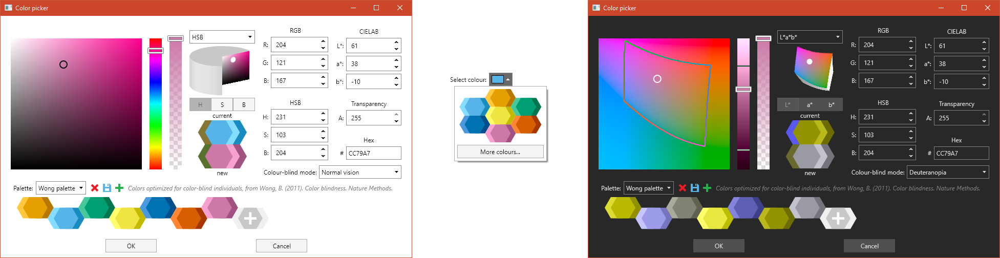

# AvaloniaColorPicker: a color picker for Avalonia


**AvaloniaColorPicker** is a colour picker control for Avalonia, with support for RGB, HSB and CIELAB colour spaces, palettes and colour blindness simulation.

The library contains three controls:

* The `ColorPicker` class represents the core of the library: a color picker control that lets users specify a color in RGB, HSB or CIELAB components, either as raw values, or by using a 1-D slider combined with a 2-D surface. It can simulate how the colours would look when viewed by people with various kinds of color-blindness and it can suggest, for any given colour, a lighter and darker shade of the colour, as well as a "contrasting colour" that is stands up against it, even when viewed by colour-blind people. It has a "palette" feature to store user-defined colours that persist between sessions and are shared between all applications using this control). Seven predefined palettes are also provided.
* The `ColorPickerWindow` class represents a window containing a `ColorPicker` and two buttons (`OK` and `Cancel`); this can be used as a dialog window to let users choose a colour.
* The `ColorButton` class represents a button displaying the currently selected colour, which can be clicked to choose another colour from the current palette or from a `ColorPickerWindow`.

The library is released under the [GPLv3](https://www.gnu.org/licenses/gpl-3.0.html) licence.



## Getting started

The library targets .NET Standard 2.0, thuis it can be used in projects that target .NET Standard 2.0+ and .NET Core 2.0+.

To use the library in your project, you should install the [AvaloniaColorPicker Nuget package](https://www.nuget.org/packages/AvaloniaColorPicker/).

This repository also contains two very simple demo projects, one using the `ColorButton` control, and one using the `ColorPicker` control.

## Usage

You will need to add the relevant `using` directive (in C# code) or the XML namespace (in the XAML code). You can then add controls from the AvaloniaColorPicker namespace. For example

```XAML
<Window ...
        xmlns:colorpicker="clr-namespace:AvaloniaColorPicker;assembly=AvaloniaColorPicker">
  ...
    <colorpicker:ColorButton Color="#56B4E9"></colorpicker:ColorButton>
  ...
</Window>
```

### `ColorPicker` control

The main properties of the `ColorPicker` control are:
* The `Color` property gets or sets the currently selected colour in the control (this is displayed in the control under "new").
* The `PreviousColor` property gets or sets the previous selected colour in the control (e.g. if you are using the control to replace a colour, this would contain the color you are replacing). This is displayed in the control under "current". If this is `null`, only the currently selected colour is displayed in the control.
* The static `TransitionsDisabled` property can be set to `true` to disable transitions. This can help avoid some graphical artifacts. This property should be set _before_ any class from the library is instantiated.
* The static `ResetDefaultPalettes()` method can be used to reset the default palettes. This will restore any deleted default palette, as well as remove any colours added to these palettes by the user. It will not have any effect on custom palettes created by the user.

### `ColorPickerWindow`

The `ColorPickerWindow` has a parameterless constructor, as well as a constructor that takes as an argument a `Color` that will be used as "previous colour" to initialise the `ColorPicker`. The `Color` and `PreviousColor` properties provide access to the homonimous properties of the underlying `ColorPicker`. The window can be shown using the asynchronous `ShowDialog` method. This methods returns a `Task<Colour?>` that, when awaited, will evaluate to `null` if the user pressed the `Cancel` button in the dialog, and to the selected colour if they pressed `OK`.

### `ColorButton` control

The `ColorButton` control provides a simple way to show the currently selected colour to the user and to let them change it. When the user clicks on the button, the current palette is shown, as well as a button to open a `ColorPickerWindow`. If no palette has yet been chosen (e.g. the first time a user clicks on the button after starting the application), or if the current palette is empty, the `ColorPickerWindow` is shown directly. The selected colour is reflected in the `Color` property of the `ColorButton`.

To be notified of changes in the selected colour, you should subscribe to the `PropertyChanged` event of the `ColorButton`, and test whether the changed property is indeed the `ColorProperty`. For example:

```Csharp
AvaloniaColorPicker.ColorButton button = this.FindControl<AvaloniaColorPicker.ColorButton>("colorButton");
//...
button.PropertyChanged += (s, e) =>
    {
        if (e.Property == AvaloniaColorPicker.ColorButton.ColorProperty)
        {
            //Do something
        }
    };
```

Please note that this event will fire even when the colour is changed programmatically (i.e. if you set the value of the `ColorPicker.Color` property in your code). The `Color` property can also be used in Avalonia styles or bindings.

## Source code

The source code for the library is available in this repository. In addition to the `AvaloniaColorPicker` library project and the two demo applications, the repository also contains a project for an application that is used to generate the `LabColorSpace.bin` cache file that is used by `AvaloniaColorPicker` to display 3D "sections" of the CIELAB colour space.