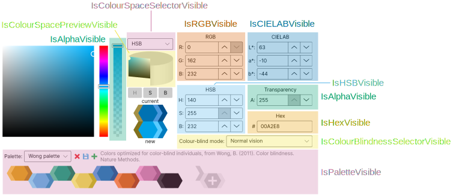

# AvaloniaColorPicker: a color picker for Avalonia


**AvaloniaColorPicker** is a colour picker control for Avalonia, with support for RGB, HSB and CIELAB colour spaces, palettes and colour blindness simulation.

The library contains three main controls:

* The `ColorPicker` class represents the core of the library: a color picker control that lets users specify a color in RGB, HSB or CIELAB components, either as raw values, or by using a 1-D slider combined with a 2-D surface. It can simulate how the colours would look when viewed by people with various kinds of color-blindness and it can suggest, for any given colour, a lighter and darker shade of the colour, as well as a "contrasting colour" that stands up against it, even when viewed by colour-blind people. It has a "palette" feature to store user-defined colours that persist between sessions and are shared between all applications using this control). Seven predefined palettes are also provided.
* The `ColorPickerWindow` class represents a window containing a `ColorPicker` and two buttons (`OK` and `Cancel`); this can be used as a dialog window to let users choose a colour.
* The `ColorButton` class represents a button displaying the currently selected colour, which can be clicked to choose another colour from the current palette or from a `ColorPickerWindow`.

In addition, the library contains the `IColorPickerWindow` interface, which defines a contract for a generic colour picker window, and the generic `ColorButton<T>` control, which can be used to obtain a control that is identical to the normal `ColorButton`, but shows a customised colour picker window instead of the default one (in particular, `ColorButton` inherits from `ColorButton<ColorPickerWindow>`).

The library is released under the [LGPLv3](https://www.gnu.org/licenses/lgpl-3.0.html) licence.


## Getting started

The library targets .NET Standard 2.0, thuis it can be used in projects that target .NET Standard 2.0+ and .NET Core 2.0+.

To use the library in your project, you should install the [AvaloniaColorPicker Nuget package](https://www.nuget.org/packages/AvaloniaColorPicker/).

This repository also contains two very simple demo projects, one using the `ColorButton` control, and one using the `ColorPicker` control.

## Usage

You will need to add the relevant `using` directive (in C# code) or the XML namespace (in the XAML code). You can then add controls from the AvaloniaColorPicker namespace. For example

```XAML
<Window ...
        xmlns:colorpicker="clr-namespace:AvaloniaColorPicker;assembly=AvaloniaColorPicker">
  ...
    <colorpicker:ColorButton Color="#56B4E9"></colorpicker:ColorButton>
  ...
</Window>
```

### `ColorPicker` control

The main properties of the `ColorPicker` control are:
* The `Color` property gets or sets the currently selected colour in the control (this is displayed in the control under "new").
* The `PreviousColor` property gets or sets the previous selected colour in the control (e.g. if you are using the control to replace a colour, this would contain the color you are replacing). This is displayed in the control under "current". If this is `null`, only the currently selected colour is displayed in the control.
* The static `TransitionsDisabled` property can be set to `true` to disable transitions. This can help avoid some graphical artifacts. This property should be set _before_ any class from the library is instantiated.
* The static `ResetDefaultPalettes()` method can be used to reset the default palettes. This will restore any deleted default palette, as well as remove any colours added to these palettes by the user. It will not have any effect on custom palettes created by the user.

### `ColorPickerWindow`

The `ColorPickerWindow` has a parameterless constructor, as well as a constructor that takes as an argument a `Color` that will be used as "previous colour" to initialise the `ColorPicker`. The `Color` and `PreviousColor` properties provide access to the homonimous properties of the underlying `ColorPicker`. The window can be shown using the asynchronous `ShowDialog` method. This methods returns a `Task<Colour?>` that, when awaited, will evaluate to `null` if the user pressed the `Cancel` button in the dialog, and to the selected colour if they pressed `OK`.

### `ColorButton` control

The `ColorButton` control provides a simple way to show the currently selected colour to the user and to let them change it. When the user clicks on the button, the current palette is shown, as well as a button to open a `ColorPickerWindow`. If no palette has yet been chosen (e.g. the first time a user clicks on the button after starting the application), or if the current palette is empty, the `ColorPickerWindow` is shown directly. The selected colour is reflected in the `Color` property of the `ColorButton`.

To be notified of changes in the selected colour, you should subscribe to the `PropertyChanged` event of the `ColorButton`, and test whether the changed property is indeed the `ColorProperty`. For example:

```Csharp
AvaloniaColorPicker.ColorButton button = this.FindControl<AvaloniaColorPicker.ColorButton>("colorButton");
//...
button.PropertyChanged += (s, e) =>
    {
        if (e.Property == AvaloniaColorPicker.ColorButton.ColorProperty)
        {
            //Do something
        }
    };
```

Please note that this event will fire even when the colour is changed programmatically (i.e. if you set the value of the `ColorPicker.Color` property in your code). The `Color` property can also be used in Avalonia styles or bindings.

### `IColorPickerWindow` interface

The `IColorPickerWindow` interface can be used to define a customised colour picker window (e.g. with a custom icon, or with more controls in addition to the colour picker). For example:

```XAML
<Window xmlns="https://github.com/avaloniaui"
        xmlns:x="http://schemas.microsoft.com/winfx/2006/xaml"
        xmlns:d="http://schemas.microsoft.com/expression/blend/2008"
        xmlns:mc="http://schemas.openxmlformats.org/markup-compatibility/2006"
        xmlns:acp="clr-namespace:AvaloniaColorPicker;assembly=AvaloniaColorPicker"
        mc:Ignorable="d" d:DesignWidth="800" d:DesignHeight="450"
        x:Class="MyColourPicker.MyColourPickerWindow"
        SizeToContent="WidthAndHeight" Title="Colour picker">
  <Grid Margin="10">
    <Grid.RowDefinitions>
      <RowDefinition Height="1*" />
      <RowDefinition Height="Auto" />
    </Grid.RowDefinitions>
    <acp:ColorPicker Name="ColorPicker" />
    <Grid Grid.Row="1">
      <Grid.ColumnDefinitions>
        <ColumnDefinition Width="1*" />
        <ColumnDefinition Width="Auto" />
        <ColumnDefinition Width="1*" />
        <ColumnDefinition Width="Auto" />
        <ColumnDefinition Width="1*" />
      </Grid.ColumnDefinitions>
      <Button Grid.Column="1" Width="100" Name="OKButton" HorizontalContentAlignment="Center">OK</Button>
      <Button Grid.Column="3" Width="100" Name="CancelButton" HorizontalContentAlignment="Center">Cancel</Button>
    </Grid>
  </Grid>
</Window>

```

```CSharp
public partial class MyColorPickerWindow : Window, IColorPickerWindow
{
    // Currently selected colour.
    public Color Color
    {
        get => this.FindControl<ColorPicker>("ColorPicker").Color;
        set
        {
            this.FindControl<ColorPicker>("ColorPicker").Color = value;
        }
    }

    // Previously selected colour (or null if not applicable).
    public Color? PreviousColor
    {
        get => this.FindControl<ColorPicker>("ColorPicker").PreviousColor;
        set
        {
            this.FindControl<ColorPicker>("ColorPicker").PreviousColor = value;
        }
    }

    private bool Result = false;

    // Parameterless constructor - required by Avalonia
    public ColourPickerWindow()
    {
        this.InitializeComponent();

        this.FindControl<ColorPicker>("ColorPicker").FindControl<TextBox>("Hex_Box").Padding = new Thickness(5, 2, 5, 2);

        this.FindControl<Button>("OKButton").Click += (s, e) =>
        {
            this.Result = true;
            this.Close();
        };

        this.FindControl<Button>("CancelButton").Click += (s, e) =>
        {
            this.Result = false;
            this.Close();
        };
    }

    // Constructor required (but not enforced).
    public ColourPickerWindow(Color? previousColor) : this()
    {
        this.PreviousColor = previousColor;

        if (previousColor != null)
        {
            this.Color = previousColor.Value;
        }
    }

    // Show the window. This method should return null if the user clicked on the "Cancel" button, and the selected colour otherwise.
    public new async Task<Color?> ShowDialog(Window parent)
    {
        await base.ShowDialog(parent);

        if (this.Result)
        {
            return this.Color;
        }
        else
        {
            return null;
        }
    }

    private void InitializeComponent()
    {
        AvaloniaXamlLoader.Load(this);
    }
}
```

You can add other controls or methods to the XAML or C# code as needed.

Note that, though this cannot be enforced by the interface, a class implementing `IColorPickerWindow` should always have a public parameterless constructor, as well as a constructor acccepting a single `Color?` parameter (this will be invoked by a `ColorButton<T>` to create and open the window).

### `ColourButton<T>` control

The `ColourButton<T>` control (where `T` inherits from `Window` and implements `IColorPickerWindow`) represents a colour button that opens a window of type `T` when the user clicks on it. You can use this control to obtain a colour button that opens your custom colour picker window as needed. For example:

```CSharp
grid.Children.Add(new ColorButton<MyColorPickerWindow>())
```

## Hiding parts of the interface

It is possible to hide some elements from the interface, if they are not needed. This can be achieved by using a number of properties of the `ColorPicker` and `ColorWindow` classes. The image below gives an overview of the controls that can be hidden and of the properties that determine their visibility.



In summary:

* `IsPaletteVisible` determines the visibility of the palette selector.
* `IsColourBlindnessSelectorVisible` determines the visibility of the colour blindness mode selector.
* `IsHexVisible` determines the visibility of the hex value selector.
* `IsAlphaVisible` determines the visibility of the alpha selector and of the alpha slider.
* `IsCIELABVisible` determines the visibility of the `L*`, `a*` and `b*` text boxes.
* `IsHSBVisible` determines the visibility of the `H`, `S` and `B` text boxes.
* `IsRGBVisible` determines the visibility of the `R`, `G` and `B` text boxes.
* `IsColourSpacePreviewVisible` determines the visibility of the 3D colour space.
* `IsColourSpaceSelectorVisible` determines the visibility of the colour space selection drop down.

Furthermore, the following properties can be used to determine which colour spaces can be selected by the user (if the colour space selector is visible):

* `IsCIELABSelectable` determines whether the CIELAB colour space can be selected.
* `IsHSBSelectable` determines whether the HSB colour space can be selected.
* `IsRGBSelectable` determines whether the RGB colour space can be selected.

If you disable the HSB colour space, you may also want to change the colour space that is selected initially, by using the `ColorSpace` property.

If you are using the `ColorPicker` or `ColorPickerWindow` controls directly, you can simply set these properties on the control. If you are instead using the `ColourButton` control, you will have to create a class that inherits from `ColorPickerWindow` to set the value of these properties, and then use the generic version of the `ColorButton` control. For example:

``` CSharp
using Avalonia;
using Avalonia.Controls;
using Avalonia.Markup.Xaml;

namespace ColorButtonDemo
{
    public class MainWindow : Window
    {
        public MainWindow()
        {
            InitializeComponent();
        }

        private void InitializeComponent()
        {
            AvaloniaXamlLoader.Load(this);

            // Create the ColourButton that shows a MyColorPickerWindow.
            AvaloniaColorPicker.ColorButton<MyColorPickerWindow> button = new AvaloniaColorPicker.ColorButton<MyColorPickerWindow>();

            // Add the ColorButton to the interface.
            Grid.SetRow(button, 1);
            Grid.SetColumn(button, 1);
            this.FindControl<Grid>("MainGrid").Children.Add(button);
        }

        // Class that inherits from ColorPickerWindow and sets the value of some properties.
        private class MyColorPickerWindow : AvaloniaColorPicker.ColorPickerWindow
        {
            // Set the value of the properties.
            private void SetProperties()
            {
                // Hide the alpha selector.
                this.IsAlphaVisible = false;

                // Hide the CIELAB component elements.
                this.IsCIELABVisible = false;
            }

            // Make sure that both constructors call the SetProperties method.
            public MyColorPickerWindow() : base() => SetProperties();
            public MyColorPickerWindow(Avalonia.Media.Color? previousColour) : base(previousColour) => SetProperties();
        }
    }
}
```

## Source code

The source code for the library is available in this repository. In addition to the `AvaloniaColorPicker` library project and the two demo applications, the repository also contains a project for an application that is used to generate the `LabColorSpace.bin` cache file that is used by `AvaloniaColorPicker` to display 3D "sections" of the CIELAB colour space.